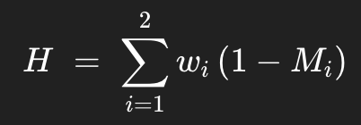

Part B - Theory Questions

# 1 - Python Concurrency:
Asyncio and native threads are best used to run I/O-bound tasks rather than multiprocessing. This happens because neither asyncio nor native threads can utilize the threads in the CPU cores. On the other hand, multiprocessing is allowed to use this resource, making it easier to execute CPU-bound tasks. This happens because asyncio and native threads are constrained by GIL (Global Interpreter Lock), which is a mutex in CPython that ensures only one thread executes Python bytecode at a time.

### Pseudocode for asyncio:

```
SERVICE-START:
  CREATE event_loop

FUNCTION handle_request_async():
  DEFINE list_of_urls
  CREATE list_of_tasks
  FOR each url IN list_of_urls:
    ADD task fetch_url(url) TO list_of_tasks
  END FOR
  results = AWAIT run_all_tasks_concurrently(list_of_tasks)
  RETURN results

ASYNC FUNCTION fetch_url(url):
  OPEN async_http_client
  response = AWAIT client.get(url)
  RETURN { url, response.status }
```

Key points:
- Single thread driven by an event loop
- AWAIT yields control during network I/O
- Thousands of fetch_url tasks can interleave without OS threads

### Pseudocode for native threads:

```
SERVICE-START:
  INITIALIZE thread_pool_executor

FUNCTION handle_request_threaded():
  DEFINE blocking_calls = [task1, task2, …]
  FOR each work_fn IN blocking_calls:
    future = SUBMIT work_fn TO thread_pool_executor
    ADD future TO futures_list
  END FOR
  results = WAIT_FOR_ALL(futures_list)
  RETURN results

FUNCTION task1():
  // e.g. a sync database query
  CONNECT to database
  data = EXECUTE query
  RETURN data
```

Key points:
- Each task runs in its own OS thread
- GIL allows other threads to run while one is blocked

### Pseudocode for multiprocessing:

```
SERVICE-START:
  INITIALIZE process_pool_executor

FUNCTION handle_request_compute(n):
  future = SUBMIT cpu_heavy_computation(n) TO process_pool_executor
  result = AWAIT future
  RETURN result

FUNCTION cpu_heavy_computation(n):
  total = 0
  FOR i FROM 1 TO n:
    total += i * i
  END FOR
  RETURN total
```

Key points:
- Each task runs in a separate Python process (its own GIL)
- True parallel use of multiple CPU cores
- Good for heavy numeric loops, image processing, ML inference

# 4 - RAG Evaluation

1 - Retriever: search for the most relevant document (e.g. as embeddings)
2 - Generator: concatenates this doc as a "context" + user query, and then call the LLM

- Automated hallucination metrics
For generated answer 𝐴 and retrieved document 𝐷:

### 1. Token Precision
**Definition:**  
Fraction of generated tokens that also appear in the retrieved document.


- \(A\): set of tokens in the answer  
- \(D\): set of tokens in the retrieved document  

---

### 2. Embedding Similarity
**Definition:**  
Average semantic similarity between each answer sentence and its best‐matching sentence in the document, using vector embeddings.


### 3. Hallucination Score

1. Measure grounding

- Token Precision (P_tok): the fraction of your generated tokens that also appear in the retrieved document (ranges from 0 to 1).

- Embedding Similarity (Sim): the average semantic closeness between each sentence of your answer and its best match in the document (also 0 to 1).

2. Define “lack of grounding”

- Since a perfectly grounded answer would have P_tok=1 and Sim=1, we look at how far we are from that ideal by computing (1 – P_tok) and (1 – Sim).

3. Weight and combine

- Assign relative importance to each dimension with weights w_tok and w_sim (they sum to 1).

- Compute the final hallucination score H as the weighted sum:



A score near 0 means the answer is well-supported by the document; a score near 1 means much of it is likely "hallucinated"


# 5 - Prompt Injection Mitigation

To create a strategy of mitigating the prompt injection, I would plan it as follows:

1. Code-Level Defenses
- Structured Prompting & Parameterization

  - Separate static and dynamic content: Build prompts with fixed templates and inject user inputs only into well-defined placeholders.

  - Escape or encode user content: Apply context-appropriate escaping (e.g., JSON-encode inside a JSON prompt, HTML-encode if rendering) so injected control sequences (like extra instructions) aren’t interpreted.

  - Use guardrail libraries: Integrate libraries like OpenAI Function Calling or guardrail frameworks (e.g., Microsoft Guidance) to enforce strict schemas on model outputs.

- Input Validation & Sanitization

  - Whitelist allowable characters or patterns for free-form inputs when possible (e.g., names, dates).

  - Blacklist known attack tokens (e.g., """, --, #, or keywords like “Ignore previous instructions”) in critical contexts.

  - Length limits: Cap input length to reduce attack surface and resource exhaustion.

- Output Filtering & Verification

  - Post-generation classifiers: Run a lightweight classifier or regex checks on the model’s response to detect policy violations (e.g., unauthorized instructions).

  - Function-level scoping: If the model is allowed to trigger actions, require a strict JSON schema and verify the parsed output against it before execution.

  - Human-in-the-loop review for high-risk operations (e.g., financial transfers, system changes).

2. Infrastructure-Level Defenses

- API Gateway Protection

  - Content inspection: Use a proxy (e.g., Kong, AWS API Gateway) to scan request bodies for suspicious patterns before reaching your service.

  - Rate limiting & quotas: Throttle requests per user or IP to limit brute-force injection attempts.

- Sandboxed Execution Environment

  - Isolate LLM calls: Run model inference in a container or VM with no direct access to production secrets or systems.

  - Network egress controls: Prevent the inference environment from calling external endpoints except the LLM API.

- Logging, Monitoring & Alerting

  - Structured logging of prompts and responses (redacting PII) to facilitate forensic analysis.

  - Anomaly detection: Alert on spikes in failed schema validations or unusual instruction patterns.

- Secrets & Key Management

  - Least-privilege credentials: Ensure the service account used for LLM access cannot modify infra settings.

  - Rotate API keys regularly and store them in a secrets manager.

3. Policy-Level Defenses

- Secure Prompting Guidelines

  - Prompt design handbook: Define organizational standards for template structure, placeholder usage, and training on known injection tactics.

  - “Red Team” exercises: Regularly attempt to break your own prompts to discover weaknesses.

- Code Reviews & Threat Modeling

  - Incorporate prompt-injection scenarios into your security review checklist.

  - Model data flows from user input → prompt → model → action, and identify trust boundaries.

- Access Controls & Governance

  - Role-based access for deploying or modifying prompt templates.

  - Approval workflows for high-risk changes to prompting logic.

- Incident Response & Audit

  - Define playbooks for suspected injection events: isolate logs, freeze model calls, and issue root-cause analyses.

  - Post-incident learning: Update templates, blacklists, and training materials based on real-world attempts.